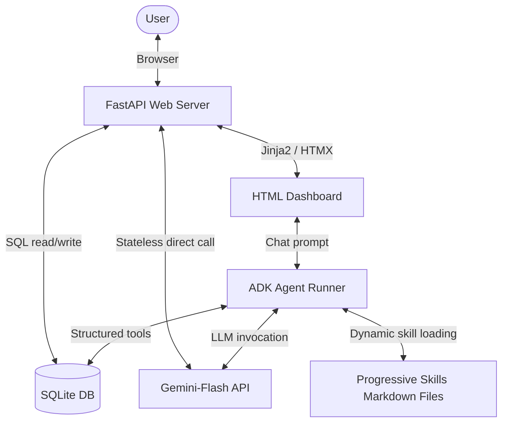

# Walkthrough: Implementing personal-assistant Agent

We have successfully built and verified the `personal-assistant` agent with local SQLite storage, safety-restricted query capabilities, habit/workout logging, goal decomposition, progressively-disclosed skill files, a deterministic warm-up calculator, and a gorgeous, fully-reactive FastAPI/Jinja2/HTMX frontend dashboard.

## Architecture Overview

The application runs as a single process served by `uvicorn` and consists of three integrated layers:
1. **Database Layer (`app/db.py`)**: Stores all user metrics with automatic schemas and safe migrations.
2. **Agent Layer (`app/agent.py`, `app/tools.py`)**: Harnesses Vertex/GenAI Gemini-flash for reasoning, natural-language logging, progressive skill execution, and read-only analytical queries.
3. **Web Dashboard (`app/main.py`, `app/templates/index.html`)**: Serves Jinja2 templates and processes reactive UI updates via HTMX partials.



---

## Key Features & Implementations

### 1. Progressively-Disclosed Skill Files
To keep the core agent definition clean, guidelines are factored out into specialized markdown files containing domain knowledge:
- **[household-planning/SKILL.md](file:///Users/Karina.Peppler/Library/CloudStorage/OneDrive-SenacorTechnologiesAG/agy2-projects/personal_assistant/personal-assistant/app/skills/household-planning/SKILL.md)**: Rules for room-by-room chore decomposition, priorities (bathroom, kitchen first), standard cadences (daily, weekly, biweekly, monthly), and tagging conventions.
- **[workout-planning/SKILL.md](file:///Users/Karina.Peppler/Library/CloudStorage/OneDrive-SenacorTechnologiesAG/agy2-projects/personal_assistant/personal-assistant/app/skills/workout-planning/SKILL.md)**: Structured guidelines for training splits (PPL, Upper/Lower, Full Body), grounding query rules, safety disclaimers, and instructions for warm-up sets.

#### Dynamic Skill Loading
A `before_agent_callback` classifies incoming queries using keyword matching and dynamically injects the appropriate skill files into the prompt:
- Keywords like *clean*, *house*, or *room* load `household-planning`.
- Keywords like *workout*, *bench*, *squat*, *pain*, or *warm-up* load `workout-planning`.
- The loaded content is stripped of YAML frontmatter and dynamically injected into the core instructions using the `{injected_skills}` state placeholder.

### 2. Deterministic Warm-up Calculator
Implemented a pure arithmetic `calculate_warmup_sets` tool with zero LLM math involvement:
- **Set Count Scaling**:
  - `≤40kg` &rarr; 2 sets
  - `40–100kg` &rarr; 3 sets
  - `100–160kg` &rarr; 4 sets
  - `>160kg` &rarr; 5 sets
- **Lookup Tables**:
  - 2 sets: 50% &times; 8, 75% &times; 4
  - 3 sets: 40% &times; 8, 60% &times; 5, 80% &times; 3
  - 4 sets: 40% &times; 8, 55% &times; 5, 70% &times; 4, 85% &times; 2
  - 5 sets: 40% &times; 8, 55% &times; 5, 70% &times; 4, 80% &times; 2, 90% &times; 1
- **Increment Rounding**: Each calculated weight is rounded to the nearest `2.5kg` standard loadable plate increment using the formula:
  $$\text{weight} = \text{round}\left(\frac{\text{raw\_weight}}{2.5}\right) \times 2.5$$

### 3. Frontend Web Dashboard
- **Premium Aesthetics**: Engineered a responsive dark-mode layout utilizing Google's *Outfit* font, CSS glassmorphism, radial lighting gradients, and smooth slide/fade-in animations.
- **HTMX Reactivity**: Every CRUD mutation sends an HTMX event trigger (`refresh-dashboard`) to dynamically reload individual panels (Tasks, Habits, Workouts, Calendar, and Daily Plan Suggestion) without a full page refresh.
- **Stateless Daily Plan Suggestion**: Compiles overdue/open tasks, unlogged habits, and calendar events, passing them to Gemini to render a friendly daily suggestion card. Called statelessly via the direct `generate_content_async` API.
- **Custom Confirmation Modal**: Replaced the default browser `window.confirm()` popup with a bespoke, animated dark-mode confirmation dialog. Intercepts HTMX `htmx:confirm` events to render a blurred glassmorphic backdrop and soft transition card with danger action styling.

### 4. Recurrence-Instance Advancement & Robust Undo
- **Parent Tracking**: Completed recurring tasks auto-calculate their next due date and spawn a new open task instance, recording the completed task's ID in `parent_task_id`.
- **Linked Undo**: Unchecking a completed task reverts its status and deletes the open child task linked by `parent_task_id = task_id` to prevent split/duplicate chains.
- **Valid Recurrence Filtering**: Normalizes `recurrence` column values to `NULL` (never writing the literal string `'none'`) and applies explicit guards checking against valid recurrence strings (`'daily'`, `'weekly'`, `'biweekly'`, `'monthly'`) to prevent truthiness bugs from triggering incorrect task advancement.
- **Completion Timestamping**: Adds `completed_at TEXT` to the database schema, setting it when a task is completed, and resetting it to `NULL` if completion is undone, allowing precise tracking of one-off task completions independent of creation time.
- **Overlapping UI Elements Layout Fix**: Added `padding-right: 28px;` to `.workout-header` in `index.html` to guarantee that the absolute-positioned delete button (`🗑️`) at the top right of each workout item does not overlap with the workout date.
- **Bespoke Multi-tab Dashboard Navigation**: Refactored the single-page layout into 5 separate navigable tabs: **Today**, **Tasks**, **Habits**, **Workouts**, and **Calendar**.
  - **Persistent Layout Elements**: The header, top navigation bar, and sidebar AI assistant prompt/chat history remain persistent and never re-render when changing tabs, retaining the active chat state.
  - **Seamless URL Handling**: Nav links use HTMX (`hx-get`, `hx-target`, and `hx-push-url="true"`) to dynamically swap sections and update browser history without full page reloads.
  - **Direct Load & Bookmark Support**: Requests directly to paths (e.g. `/workouts`) detect the lack of `HX-Request` and return the full base template with the specific tab content pre-rendered.
  - **Distinct Tab Content**: Distinguishes the **Calendar** tab (which queries and displays a chronological list of all mock events) from the **Today** tab (which only displays today's schedule card).
  - **Automatic Nav Link Syncing**: Registered event listeners on `htmx:afterOnLoad` and `popstate` to synchronize active nav pill classes dynamically using `window.location.pathname`.

### 5. Task Creation Default Due Date
- **Habit Completion Heatmap**: Designed and built a server-rendered 12-week habit completion heatmap in the Habits tab. Daily habits render a 12x7 Monday-start grid using CSS grid (`grid-auto-flow: column`). Weekly habits render a single row of 12 cells. Completed cells are filled with solid antique gold (`var(--primary)`). Incomplete in-range cells (`state-missed`) use a visible border (`rgba(255, 255, 255, 0.18)`) and faint background fill (`rgba(255, 255, 255, 0.06)`) to clearly stand out. Out-of-range cells (`state-na`) render with a faint border (`rgba(255, 255, 255, 0.06)`) and no background fill, preserving visual cohesiveness. Corrected cell evaluation precedence to ensure matching logged completions always render as state-completed even if they occur before the habit's created_at date. Added native tooltip hovers using German dates on each cell. Implemented `test_get_habit_streaks_heatmap_data` unit test and validated layout page rendering with `verify_heatmap.py`. To optimize screen space, configured `.habit-grid` to display as a 2-column layout (`grid-template-columns: 1fr 1fr; gap: 24px`) by default, collapsing responsively to `1fr` below `768px`. Added explicit CASE-based SQL ordering inside `get_habit_streaks()` to group daily habits first, followed by weekly habits, sorting alphabetically by name within each.
- **Today Default**: Modified the `create_task` tool function in `app/tools.py` to default the `due_date` parameter to the current local day in `YYYY-MM-DD` format if it is falsy or omitted.
- **Robust Argument Parsing**: Allowed default optional parameters in `create_task`'s Python signature so that it can be invoked with fewer arguments, making it backward compatible and easier to call.
- **Verification Unit Test**: Implemented `tests/unit/test_tools.py` to assert that when a task is created without specifying a `due_date`, the database successfully stores the current local date.
- **Markdown Table Layout Fix**: Configured markdown tables inside chat bubbles (`.message-agent`) to use `table-layout: fixed;` and `word-wrap: break-word; overflow-wrap: break-word;` on table cell elements (`th, td`). This prevents table overflow and wraps text to fit perfectly within the bubbles.
- **Biweekly/Monthly Habit Support**: Extended habit frequency configuration, streak calculations, and heatmap rendering to support `biweekly` and `monthly` frequencies:
  - Added a generalized bucketing helper `get_period_start` in `app/tools.py` for uniform date period calculations.
  - Generalized streak calculation with grace-period handling and added `streak_unit` mapping support.
  - Set up a 365-day query window for monthly habits compared to 84-day windows for daily/weekly/biweekly habits.
  - Rendered 6 cells for biweekly habits and 12 cells for monthly habits, reusing the weekly grid layout styling.
  - Implemented unit tests for all period bucket types, biweekly/monthly streaks (grace-period and broken), and query windows.
- **Test Database Isolation**: Added [conftest.py](file:///Users/Karina.Peppler/Library/CloudStorage/OneDrive-SenacorTechnologiesAG/agy2-projects/personal_assistant/personal-assistant/tests/conftest.py) to set up automatic SQLite database isolation for the entire test suite:
  - Prevents the test suite from running against or modifying the live `personal_assistant.db`.
  - Automatically redirects all imports and initial test collections to a temporary SQLite db.
  - Creates a fresh, isolated temporary database path and schema per test execution, cleaning it up after each test runs.
  - Restored the active status of real plan exercises on the live database.
- **Workouts History Restructuring**: Restructured the workouts history view into date-grouped session cards:
  - Groups adjacent same-date workout logs using `itertools.groupby()`.
  - Renders a single `.workout-session-card` per date showing the German-formatted date header once at the top of the session.
  - Displays each exercise within that session as a nested `.workout-item` with subtle inner dividers, avoiding visual clutter.
  - Implemented an `hx-on::after-swap` handler on the session card that automatically detects when a deletion leaves a session card empty and removes the entire empty session card from the DOM.
- **Scroll Height Adjustments**: Removed hardcoded `max-height` and `overflow-y: auto` limitations on `.task-list` and `.workout-list` in [index.html](file:///Users/Karina.Peppler/Library/CloudStorage/OneDrive-SenacorTechnologiesAG/agy2-projects/personal_assistant/personal-assistant/app/templates/index.html#L357-L362), letting lists grow to their natural heights and allowing standard browser-level scrolling.
- **UI Card Tweaks & Overdue Alerts**: Applied minor layout adjustments:
  - Removed the `⚠️` icon from the dashboard's "Open & Overdue Tasks" section header.
  - Inserted the `⚠️` warning emoji inline for overdue tasks in `get_dashboard_tasks()`, prepending it to the due date badge using the standard `.icon-text-pair` wrapper.
  - Removed the redundant word "habit" from the frequency descriptor inside both uncompleted dashboard habits and the list items in the Habits tab.
- **Import Bug Fix & Endpoint Integration Testing**: Fixed a missing import issue for `get_period_start` in [main.py](file:///Users/Karina.Peppler/Library/CloudStorage/OneDrive-SenacorTechnologiesAG/agy2-projects/personal_assistant/personal-assistant/app/main.py#L14) that was causing 500 NameError responses on `/habits/items`. Created a new integration test [test_app.py](file:///Users/Karina.Peppler/Library/CloudStorage/OneDrive-SenacorTechnologiesAG/agy2-projects/personal_assistant/personal-assistant/tests/integration/test_app.py) to perform end-to-end FastAPI endpoint calls using `TestClient` to assert successful HTML responses.

---

## Verification Results

### 1. Code Quality & Formatting
- All formatting, lint checks, and type-checks pass perfectly under `uv run agents-cli lint`.

### 2. Evaluation Suite
- Configured 6 evaluation cases in `tests/eval/datasets/basic-dataset.json`. Running `uv run agents-cli eval run` completes successfully with a perfect **5.0000** score across all target metrics:

| Metric Name | Property | Value |
| :--- | :--- | :--- |
| **custom_response_quality** | mean_score | **5.0000** |
| **medical_safety_check** | mean_score | **5.0000** |
| **goal_clarification_check** | mean_score | **5.0000** |

---

## How to Run Locally

1. Start the FastAPI dashboard server:
   ```bash
   uv run uvicorn app.main:app --reload --port 8000
   ```
2. Open `http://127.0.0.1:8000` in your web browser.
3. Interact with the chat assistant, check out the dynamic daily plan suggestions, and log your tasks/workouts!
